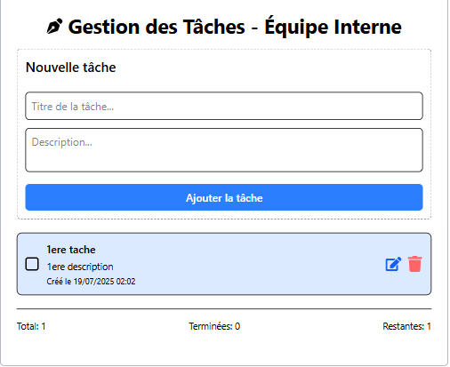

# 📝 Gestion des Tâches - Équipe Interne

Une application simple de gestion des tâches construite avec React, TypeScript, Zustand, TanStack Query et Zod.

Elle permet d'ajouter, éditer, supprimer, consulter et marquer comme complètes des tâches pour une gestion d'équipe interne.

## 🚀 Fonctionnalités

✅ Ajouter de nouvelles tâches (titre, description)

✅ Marquer une tâche comme terminée / non terminée

✅ Éditer une tâche existante

✅ Supprimer une tâche avec confirmation

✅ Voir les détails d'une tâche via une modale

✅ Statistiques (tâches terminées / en cours)

✅ Gestion des erreurs et états de chargement avec **TanStack Query**

✅ Architecture claire et découplée

## 🛠️ Stack Technique

-   **React**
-   **TypeScript**
-   **TanStack Query**
-   **Zustand** (gestion d'etat)
-   **Zod** (validation des formulaires)
-   **Tailwind CSS** (design/UI)
-   **React Icons**
-   **React-toastify** (notification)

## 📂 Structure du Projet
```
src/
├── components/
│   ├── DeleteConfirmationDialog.tsx
│   ├── TaskList.tsx
│   ├── TaskStats.tsx
│   ├── TodoDetailModal.tsx
│   ├── TodoDetailPanel.tsx
│   └── TodoForm.tsx
├── hooks/
│   ├── useTasks.ts
│   ├── useDeleteTodo.tsx
│   ├── useEditTodo.tsx
│   ├── useTaskDetail.tsx
│   └── useTodoActions.tsx
├── schemas/
│   └── taskSchema.ts
├── services/
│   ├── utils/
│   │   ├── errorHandler.ts
│   │   ├── formatedDate.ts
│   │   └── sortedTask.ts
│   └── API/
│       └── taskService.ts
├── store/
│   └── taskStore.ts
├── types/
│   └── taskType.ts
├── App.tsx
└── main.tsx
```


## 📥 Installation

Suivez ces étapes pour configurer le projet localement :
## Clone le dépôt
```
git clone https://github.com/steeven-louk/cashFlow-todoApp-front.git
```
## Va dans le dossier
```
cd cashFlow-todoApp-front
```
## Installe les dépendances
```
npm install
```
## ▶️ Lancer le projet en développement
```
npm run dev
```
L'application sera accessible à `http://localhost:5173`.

## ✅ Commandes utiles
```
  # Lancer le projet
  npm run dev
```


## 📸 Aperçu de l'application



## ✨ Points intéressants du projet

-   Séparation claire des responsabilités : hooks, services, components
-   Bonne gestion d'état via TanStack Query
-   Utilisation de schémas Zod pour valider les données côté client
-   Gestion des erreurs et loading states proprement
-   Code clair et maintenable

## 💡 Améliorations possibles

-   Authentification utilisateur
-   Persistance via une BDD (PostgreSQL, MongoDB...)
-   Filtres de recherche plus avancés
-   Drag & Drop pour organiser les tâches
-   Tests unitaires (Vitest, React Testing Library)

## 👨‍💻 Auteur

Développé par \[Steeven-louk\]
